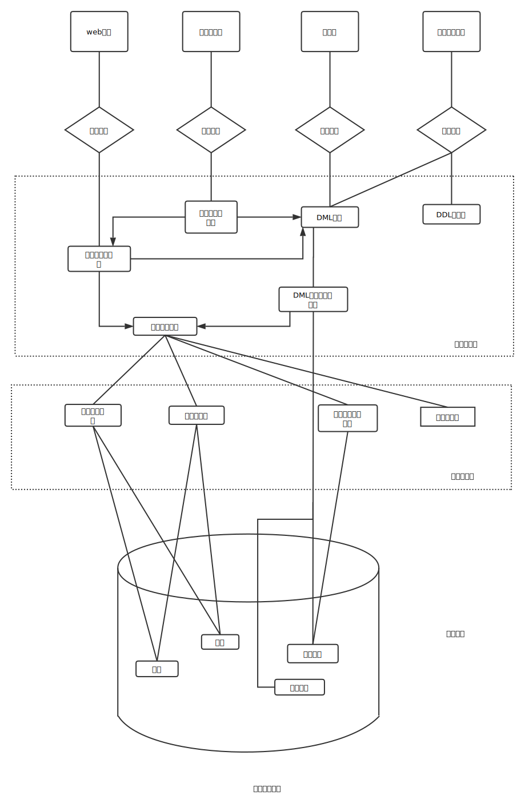

数据模型可以被划分为四类

##### 关系模型
关系模型(relational model)用表的集合来记录数据和数据间的联系。 每个表有多个列， 每列有唯一的列名。关系模型是基于记录的模型的一种。基于记录的模型的名称的由来是因为数据库是由若干种固定格式的记录来构成的。每个表包含某种特定类型的记录。每个记录类型定义了固定数目的字段。关系数据模型是使用最广泛的数据模型， 大量的数据库系统都基于这种关系模型。

##### 实体-联系模型
实体-联系模型(entity-relationship model)基于对现实世界的认知: 现实世界由一组被称作实体的基本对象以及这些对象间的联系构成。 实体是现实世界中可区别于其他对象的一件"事情"或一个"物体"。实体-联系模型被广泛用于数据库设计。

##### 基于对象的数据模型(object-based data model)
面向对象的数据模型可以看成E-R模型增加了封装、方法和对象标识等概念后的扩展。 对象-关系数据模型结合了面向对象的数据模型和关系数据模型特征

##### 半结构化数据模型(semistructured data model)
半结构化数据模型允许那些相同类型的数据项含有不同的属性集的数据含义。这和前面提到的数据模型形成了对比: 在那些数据模型中所有某种特定类型的数据项必须有相同的属性集。可扩展标记语言(XML)被广泛地用来表示半结构化数据。

#### 存储管理器
存储管理器是数据库系统中负责在数据库中存储的低层数据与应用程序以及向系统提交的查询之间提供接口的部件。存储管理器部件包括:
1. 权限及完整性管理器(authorization and integrity manager): 它检测是否满足完整性约束， 并检查试图访问数据的用户的权限
2. 事务管理器(transition manager): 它保证了即使发生故障， 数据库也保持在一致的(正确的)状态， 并保证并发事务的执行不发生冲突
3. 文件管理器(file manager): 它管理磁盘存储空间的分配，管理用于表示磁盘上所存信息的数据结构
4. 缓冲区管理器(buffer manager): 它负责将数据从磁盘上取到内存中来， 并决定哪些数据应被缓冲在内存中。 

#### 事务管理
事务的三个要求: 
1. 原子性: 一组操作要么都发生要么都不发生。
2. 一致性: 一组操作完成前后， 其所产生的改变必须满足某种特定规则
3. 持久性: 操作完成之后， 即使系统发生故障， 数据也必须是操作之后的新值

#### 数据库体系结构

