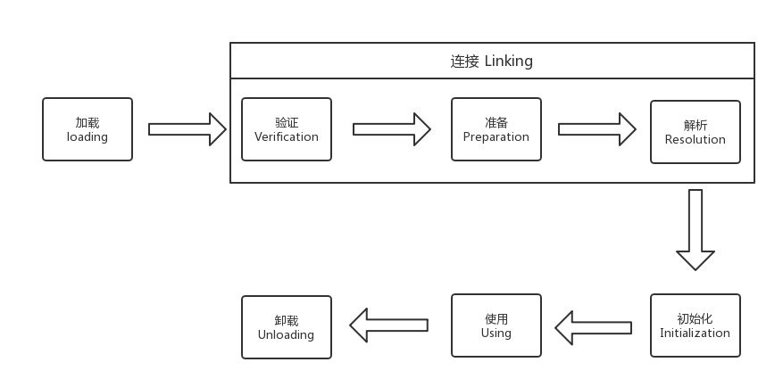

#### 类加载的时机
类从被加载到虚拟机内存开始, 到卸载出内存为止, 经历了如下七个阶段

其中, 加载、验证、准备、初始化和卸载这五个阶段的顺序是确定的. 而解析阶段则不一定, 它在某些情况下可以在初始化阶段之后再开始, 这是为了支持Java语言的运行时绑定. 对于加载的时机, 虚拟机规范中并没有进行强制约束, 但对于初始化阶段, 虚拟机规范则是严格规定了有且只有四种情况必须立即对类进行"初始化".
1. 遇到new、getstatic、pustatic或invokestatic这4条字节码指令时, 如果类没有进行过初始化, 则需要先触发其初始化.
2. 使用java.lang.reflect包的方法对类进行反射调用的时候, 如果类没有进行过初始化, 则需要先触发其初始化.
3. 当初始化一个类的时候, 如果发现其父类还没有进行过初始化, 则需要先触发其父类的初始化.
4. 当虚拟机启动时, 用户需要指定一个要执行的主类(包含main()方法), 虚拟机会先初始化这个主类.  
这四种场景中的行为称为对一个类进行主动引用. 除此之外所有引用类的方式, 都不会触发初始化, 称为被动引用.  
对于静态字段, 只有直接定义这个字段的类才会被初始化, 因此通过其字类来引用父类中定义的静态字段, 只会触发父类的初始化而不会触发字类的初始化. 至于是否要触发子类的加载和验证, 在虚拟机规范中并未明确规定, 这点取决于虚拟机的具体实现.