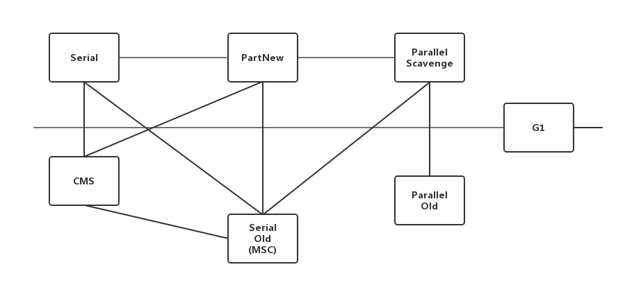

#### 垃圾收集策略

##### 引用记数算法
Java中没有选用计数算法来管理内存, 最主要的原因是它很难解决对象之间的相互循环引用的问题.

##### 根搜索算法
通过一些列的名为"GC Roots"的对象作为起始点, 从这些节点开始向下搜索, 搜索所走过的路径称为引用链(Reference Chain), 当一个对象达GC Roots没有任何引用链相连(从GC Roots到这个对象不可达)时, 则证明此对象是不可用的. 在Java中, 可作为GC Roots的对象包括下面几种.
1. 虚拟机栈(栈帧的本地变量表)中的引用的对象
2. 方法区中的类静态属性引用的对象
3. 方法区中的常量引用的对象
4. 本地方法栈中JNI的引用的对象
##### Java中的引用类型
1. 强引用(Strong Reference): 强引用就是指在程序代码之中普遍存在的, 类似"Object obj = new Object()"这类的引用, 只要强引用还存在, 垃圾收集器永远不会回收掉被引用的对象
2. 软引用(Soft Reference): 用来描述一些还有用, 但并非必需的对象. 对于软引用关联着的对象, 在系统将要发生内存溢出异常之前, 将会把这些对象列进回收范围之中并进行第二次回收. 如果这次回收还是没有足够的内存, 才会抛出内存溢出异常. JDK1.2后, 提供了SoftReference类来实现软引用
3. 弱引用(Weak Reference): 也是用来描述非必需对象的, 但是它的强度比软引用更弱一些, 被弱引用关联的对象只能生存到下一次垃圾收集发生之前. JDK1.2后, 提供了WeakReference类来实现弱引用
4. 虚引用(Phantom Reference): 也称为幽灵引用或者幻影引用, 它是最弱的一种引用关系. 一个对象是否有虚引用的存在, 完全不会对其生存时间构成影响. JDK1.2之后, 提供了PhantomReference类来实现虚引用.

##### 两次标记过程
对象在进行根搜索后发现没有与GC roots相连接的引用链, 它将会被第一次标记并且进行一次筛选, 筛选的条件是此对象是否有必要执行finalize()方法. 当对象没有覆盖finalize()方法或finalize()方法已经被虚拟机调用过, 虚拟机将这两种情况视为"没有必要执行". finalize()方法只会被系统自动调用一次.
如果对象被判定为有必要执行, 将会被放置在一个名为F-Queue的队列中, 并会在稍后由虚拟机建立的低优先级的Finalizer线程去执行. 虚拟机会触发finalize()方法, 但可能不会等待其执行结束, 原因是为了避免finalize()执行时间过长导致内存回收崩溃. 稍后GC将对F-Queue中的对象进行第二次小规模的标记,如果对象在finalize()中成功将自己与引用链上的任何一个对象建立关联, 则可以避免被回收.  
但finalize()方法的开销非常大, 不建议使用它. ?

##### 回收方法区
永久代的垃圾收集主要回收两部分内容: 废弃常量和无用的类. 回收废弃常量与回收Java堆中的对象非常类似. 判定一个类是否是无用的类条件会苛刻很多. 需要满足下面三个条件.  
1. 该类所有的实例都已经被回收, 也就是Java堆中不存在该类的任何实例
2. 加载该类的ClassLoader已经被回收
3. 该类对应的java.lang.Class对象没有任何地方被引用, 无法在任何地方通过反射访问该类的方法.  
并不是满足条件就会回收, 需要虚拟机特定参数来控制.

#### 垃圾回收算法

##### 标记-清除(Mark-Sweep)算法
首先标记出所有需要回收的对象, 在标记完成后统一回收掉所有被标记的对象, 是最基础的收集算法. 主要有两个缺点: 
1. 效率问题. 标记和清除过程的效率都不高
2. 空间问题. 标记清除之后会产生大量不连续的内存碎片, 空间碎片太多可能会导致, 当程序在以后的运行过程中需要分配较大对象时无法找到足够的连续内存而不得不提前触发另一次垃圾收集动作.

##### 复制算法
它将可用内存按容量分为大小相等的两块, 每次只使用其中的一块. 当一块用完了, 就将还存活的对象复制到另一块上面, 然后再把已使用过的内存空间一次清理掉. 现在的商业虚拟机采用这种算法来回收新生代. 但并不是按照1:1的比例来划分内存空间, 而是将内存分为一块较大的Eden空间和两块较小的Survivor空间, 每次使用Eden和其中的一块Survivor. 当回收时, 将Eden和Survivor中还存活着的对象一次性地拷贝到另外一块Survivor空间上, 最后清理掉Eden和刚才用过地Survivor空间. HotSpot虚拟机默认Eden和Survivor的大小比例是8:1. 但并无法保证每次回收都有不多于10%的对象存活, 当Survivor空间不够时, 需要依赖其他内存(这里指老年代)进行分配担保(Handle Promotion)

##### 标记-整理(Mark-Compact)算法
主要使用在老年代. 标过程与"标记-清除"算法一样, 但后续步骤不是直接对可回收对象进行清理, 而是让所有存活的对象都向一端移动, 然后清理掉边界以外的内存.

##### 分代收集算法
根据对象的存活周期的不同将内存划分为几块. 一般是把Java堆分为新生代和老年代, 根据各个年代的特点采用最适当的收集算法. 

#### 垃圾收集器
收集算法是内存回收的方法论, 垃圾收集器就是内存回收的具体实现.  
HotSpot JVM1.6中的垃圾收集器


##### Serial收集器
新生代垃圾收集.这是一个单线程的收集器. 它进行垃圾收集时, 必须暂停其他所有的工作线程, 直到它收集结束. 它优于其他收集器的地方: 简单而高效, 对于限定单个CPU的环境来说, Serial收集器没有线程交互的开销, 可以获得最高的单线程收集效率.

##### ParNew收集器
新生代垃圾收集器.ParNew收集器就是Serial收集器的多线程版本,除了使用多条线程进行垃圾收集外, 其余行为包括控制参数、收集算法、对象分配规则、回收策略等都与Serial收集器完全一样. ParNew收集器是使用-XX:+UseConcMarkSweepGC选项后的默认新生代收集器, 也可以使用-XX:UseParNewGC选项来强制指定它

##### Parallel Scavenge收集器
新生代收集器. 使用复制算法, 也是并行多线程收集器. Parallel Scavenge收集器的特点是它的关注点与其他收集器不同. CMS等收集器的关注点尽可能缩短垃圾收集时用户线程的停顿时间, 而Parallel Scavenge收集器的目标则是达到一个可控制的吞吐量(throughput).  
停顿时间越短越适合需要与用户交互的程序, 良好的响应速度能提升用户的体验; 而高吞吐量则可以最高效率地利用CPU时间, 尽快地完成程序地运算任务, 主要适合在后台运算而不需要太多交互的任务.  
Parallel Scavenge收集器提供了两个参数用于精确控制吞吐量. -XX:MaxGCPauseMillis控制最大垃圾收集停顿时间, -XX:GCTimeRatio控制吞吐量大小.  
Parallel Scavenge收集器还有一个参数-XX:UseAdaptiveSizePolicy. 这是一个开关值, 不需要手工指定新生代大小(-Xmn), Eden与Survivor区的比例(-XX:SurvivorRatio), 晋升老年代对象年龄(-XX:PretenureSizeThreshold)等细节参数. 虚拟机会根据当前系统的运行情况收集性能监控信息, 动态调整这些参数以提供最合适的停顿时间或最大的吞吐量, 这种调节方式称为GC自适应的调节策略(GC Ergonomics). 自适应调节策略也是Parallel Scavenge收集器与ParNew收集器的一个重要区别.

##### Serial Old收集器
Serial Old是Serial收集器的老年代版本. 这收集器的主要意义也是被Client模式下的虚拟机使用. 如果在Server模式下, 还有两大用途: 
1. 在JDK1.5及之前的版本中与Parallel Scavenge收集器搭配使用.
2. 作为CMS收集器的后备预案, 在并发收集发生Concurrent Mode Failure的时候使用.

##### Parallel Old收集器
Parallel Old是Parallel Scavenge收集器的老年代版本. 使用多线程和"标记-整理"算法.

##### CMS收集器
CMS(Concurrent Mark Sweep)收集器是一种以获取最短回收停顿时间为目标的收集器. 它的运作过程相对复杂, 整个过程分为4个步骤: 
1. 初始标记(CMS initial mark)
2. 并发标记(CMS concurrent mark)
3. 重新标记(CMS remark)
4. 并发清除(CMS concurrent sweep)  
其中初始标记、重新标记这两个步骤是单线程的. 初始标记仅仅是标记一下GC Roots能直接关联到的对象, 速度很快. 并发标记阶段就是进行GC Roots Tracing的过程, 而重新标记阶段则是为了修正并发标记期间, 因用户程序继续运作而导致标记产生变动那一部分对象的标记记录.  

整个过程中耗时最长的是并发标记和并发清除. CMS称之为低停顿收集器(Concurrent Low Pause Collector), 但它有三个显著的缺点:
1. CMS收集器对CPU资源非常敏感.
2. CMS收集器无法处理浮动垃圾(Floating Garbage), 可能出现"Concurrent Mode Failure"失败而导致另一次Full GC的产生. 有一部分垃圾出现于标记过程之后, CMS无法在本次收集中处理掉它们, 只好留在下一次GC时再将其清理掉, 这一部分垃圾就称为"浮动垃圾". 由于在垃圾收集阶段, 用户线程还在执行, 因此垃圾收集工作需要在老年代被占满之前进行. 默认老年代在使用了68%之后会触发垃圾收集. 可以通过参数-XX:CMSInitiatingOccupancyFraction的值来提高触发百分比. 出现"Concurrent Mode Failure"失败会临时启用Serial Old收集器重新进行老年代的垃圾收集, 会导致停留时间变长
3. 收集结束会产生大量空间碎片.

##### G1(Garbage First)收集器
基于"标记-整理"算法实现; 可以非常精确地控制停顿, 能让使用者明确指定一个长度为M毫秒地时间片段内, 消耗在垃圾收集上的时间不超过N毫秒. G1将整个Java堆(包括新生代, 老年代)划分为多个大小固定的独立区域, 并且跟踪这些区域里面的垃圾收集程度, 在后台维护一个优先列表, 每次根据允许的收集时间, 优先回收垃圾最多的区域(Garbage First名字的由来)

#### 内存分配

##### 对象优先在Eden分配
参照如下代码进行测试:
```java
/**
 * @author lungern lungern.site@outlook.com
 * @date 2018/3/30 14:20
 * @description
 *      VM args: -verbose:gc -Xms20M -Xmx20M -Xmn10M -XX:SurvivorRatio=8
 */

public class MemoryAllocation {

    public static final int _1MB = 1024 * 1024;

    public static void testAllocation() {
        byte [] allocation1, allocation2, allocation3, allocation4;
        allocation1 = new byte[2 * _1MB];
        allocation2 = new byte[2 * _1MB];
        allocation3 = new byte[2 * _1MB];
        allocation4 = new byte[4 * _1MB];
    }

    public static void main(String[] args) {
        testAllocation();
    }
}

```
在jdk8中测试结果如下
```
Heap
 PSYoungGen      total 9216K, used 8192K [0x00000000ff600000, 0x0000000100000000, 0x0000000100000000)
  eden space 8192K, 100% used [0x00000000ff600000,0x00000000ffe00000,0x00000000ffe00000)
  from space 1024K, 0% used [0x00000000fff00000,0x00000000fff00000,0x0000000100000000)
  to   space 1024K, 0% used [0x00000000ffe00000,0x00000000ffe00000,0x00000000fff00000)
 ParOldGen       total 10240K, used 4096K [0x00000000fec00000, 0x00000000ff600000, 0x00000000ff600000)
  object space 10240K, 40% used [0x00000000fec00000,0x00000000ff000010,0x00000000ff600000)
 Metaspace       used 3281K, capacity 4496K, committed 4864K, reserved 1056768K
  class space    used 359K, capacity 388K, committed 512K, reserved 1048576K
```
在无对象创建时, eden区中仍有2M空间被占用, 用途未知
> 新生代GC(Minor GC): 指发生在新生代的垃圾收集动作.  
老年代GC(Full GC): 指发生在老年代的GC, 出现了Major GC, 经常会伴随至少一次的Minor GC. Major GC的速度一般会比Minor GC慢10倍以上

##### 大对象直接进入老年代
在Java8中的默认垃圾回收器中, 直接设置-XX:PretenureSizeThreshold已经不会生效. 因为这个参数只对串行回收器和ParNew有效

##### 长期存活的对象将进入老年代
虚拟机给每个对象定义了一个年龄计数器. 如果对象在Eden出生并经过第一次Minor GC后仍然存活, 并且能被Survivor容纳, 将被移动到Survivor空间中, 并将对象年龄设为1. 对象在Survivor区中每熬过一次Minor GC, 年龄就加1岁, 年龄增加到一定程度(默认为15)时, 就会被晋升到老年代中.  
在JDK8中的虚拟机默认情况下忽略了-XX:MaxTenuringThreshold参数. 下面会对-XX:MaxTenuringThreshold的值为1和15分别进行测试.
测试代码如下:
```java
    public static final int _1MB = 1024 * 1024;
    /**
     * VM args: -verbose:gc -Xms20M -Xmx20M -Xmn10M -XX:PrintTenuringDistribution -XX:+UseSerialGC
     * -XX:+PrintGCDetails -XX:SurvivorRatio=8 -XX:MaxTenuringThreshold=1
     */
    public static void testTenuringThreshold() {
        byte[] allocation1, allocation2, allocation3;

        allocation1 = new byte[_1MB / 4];
        allocation2 = new byte[4 * _1MB];
        allocation3 = new byte[4 * _1MB];
        allocation3 = null;
        allocation3 = new byte[4 * _1MB];
    }
```
-XX:MaxTenuringThreshold的值为1时的输出
```
    [GC (Allocation Failure) [DefNew
    Desired survivor size 524288 bytes, new threshold 1 (max 1)
    - age   1:     880328 bytes,     880328 total
    : 6244K->859K(9216K), 0.0037376 secs] 6244K->4955K(19456K), 0.0044089 secs] [Times: user=0.00 sys=0.00, real=0.00 secs] 
    [GC (Allocation Failure) [DefNew
    Desired survivor size 524288 bytes, new threshold 1 (max 1)
    - age   1:        264 bytes,        264 total
    : 5039K->0K(9216K), 0.0010081 secs] 9135K->4951K(19456K), 0.0010240 secs] [Times: user=0.00 sys=0.00, real=0.00 secs] 
    Heap
     def new generation   total 9216K, used 4234K [0x00000000fec00000, 0x00000000ff600000, 0x00000000ff600000)
      eden space 8192K,  51% used [0x00000000fec00000, 0x00000000ff022928, 0x00000000ff400000)
      from space 1024K,   0% used [0x00000000ff400000, 0x00000000ff400108, 0x00000000ff500000)
      to   space 1024K,   0% used [0x00000000ff500000, 0x00000000ff500000, 0x00000000ff600000)
     tenured generation   total 10240K, used 4951K [0x00000000ff600000, 0x0000000100000000, 0x0000000100000000)
      the space 10240K,  48% used [0x00000000ff600000, 0x00000000ffad5c50, 0x00000000ffad5e00, 0x0000000100000000)
     Metaspace       used 3278K, capacity 4496K, committed 4864K, reserved 1056768K
      class space    used 359K, capacity 388K, committed 512K, reserved 1048576K
```
-XX:MaxTenuringThreshold的值为15时的输出
```
[GC (Allocation Failure) [ParNew
Desired survivor size 524288 bytes, new threshold 1 (max 15)
- age   1:     880672 bytes,     880672 total
: 6244K->898K(9216K), 0.0025589 secs] 6244K->4994K(19456K), 0.0025924 secs] [Times: user=0.00 sys=0.00, real=0.00 secs] 
[GC (Allocation Failure) [ParNew
Desired survivor size 524288 bytes, new threshold 15 (max 15)
- age   1:      24888 bytes,      24888 total
: 5078K->196K(9216K), 0.0005205 secs] 9174K->5182K(19456K), 0.0005376 secs] [Times: user=0.00 sys=0.00, real=0.00 secs] 
Heap
 par new generation   total 9216K, used 4430K [0x00000000fec00000, 0x00000000ff600000, 0x00000000ff600000)
  eden space 8192K,  51% used [0x00000000fec00000, 0x00000000ff022948, 0x00000000ff400000)
  from space 1024K,  19% used [0x00000000ff400000, 0x00000000ff431208, 0x00000000ff500000)
  to   space 1024K,   0% used [0x00000000ff500000, 0x00000000ff500000, 0x00000000ff600000)
 tenured generation   total 10240K, used 4985K [0x00000000ff600000, 0x0000000100000000, 0x0000000100000000)
   the space 10240K,  48% used [0x00000000ff600000, 0x00000000ffade728, 0x00000000ffade800, 0x0000000100000000)
 Metaspace       used 3280K, capacity 4496K, committed 4864K, reserved 1056768K
  class space    used 359K, capacity 388K, committed 512K, reserved 1048576K
```

##### 动态对象年龄判定
如果在Survivor空间中相同年龄所有对象大小的总和大于Survivor空间的一半, 年龄大于或等于该年龄的对象就可以直接进入老年代, 无须等到MaxTenuringThreshold中要求的年龄.

##### 空间分配担保
在发生Minor GC时, 虚拟机会检测之前每次晋升到老年代的平均大小是否大于老年代的剩余空间大小, 如果大于, 则改为直接进行一次Full GC. 如果小于, 则查看HandlePromotionFailure设置是否允许担保失败; 如果允许, 那只会进行Minor GC;如果不允许, 则也要改为进行一次Full GC.