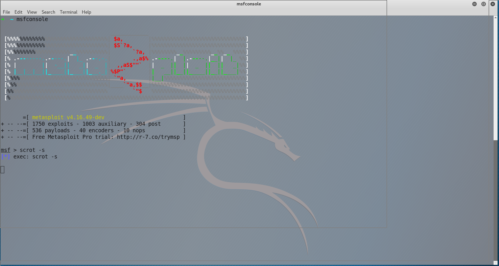

#### 准备Metasploit实验环境
在学习如何使用Metasploit之前， 我们需要保证我们的设置能够符合或者超出接下来要提到的系统要求。准备Metasploit实验环境有助于消除接下来要在文中出现的许多问题。 我们建议使用虚拟机(又叫管理程序)来管理实验环境。


### Metasploit Unleashed硬件要求
下列所有值都是估计值或建议值。你也可以使用低于这些值的配置， 不过性能会受到影响。

#### 硬盘空间
至少需要10GB的存储空间。我们需要使用有很大文件尺寸的虚拟机， 这就意味着不能使用FAT32格式分区，因为它无法支持大文件。选择NTFS，ext3或其他格式。建议尺寸是30GB.  
如果在你学习这门课程的过程中需要创建系统副本或快照，它们将在你的电脑上占据相当大的空间。 警惕这些问题，当需要的话， 不要害怕去扩展空间。

#### 可用内存
如果没有给你的主机和客户机提供足够的内存，将会导致系统错误。根据你的情况，使用下面的指南来帮助你决定需要的内存大小。
```
Linux "HOST" 最小内存要求
1GB内存(RAM)
实际使用需要2GB或更多

Kali "Guest" 最小内存要求
至少需要512MB内存(建议1GB)  //多多益善
正常使用需要1GB以上的内存，和等量的交换文件空间

Metasploitable "Guest" 最小内存要求
最少256MB内存(建议512MB)

(可选)每个Windows "Guest"最小内存要求
最少256MB内存(建议1GB)
正常使用需要1GB以上的内存，和等量的交换文件空间
```

#### 处理器
