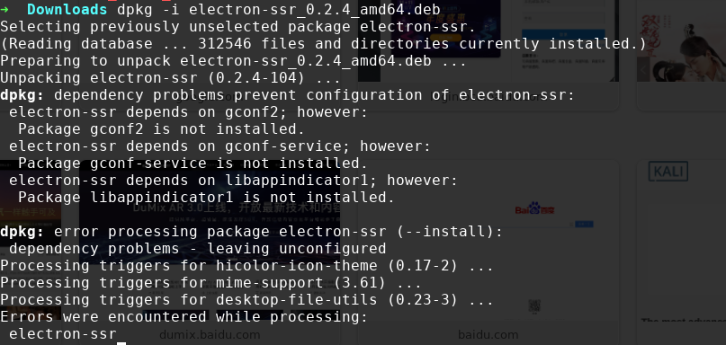
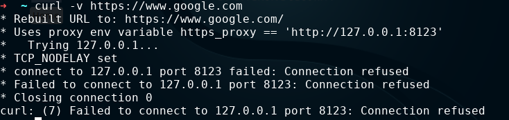
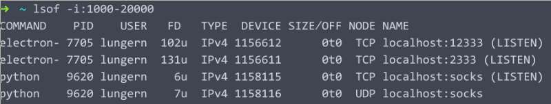

### 前言
最近捡起了好久没有用的parrot linux系统. 本想着闲来无事, 找个网站学习一下渗透的. 不曾想在使用google的时候, 发现竟然无法连接上. 虽然路由器上也已经装了ssr客户端, 但是由于未知的原因, 路由器的工作一直不太稳定. 既然如此, 那只好在本地搭建一个ssr的客户端. 由于github上的ssr项目客户端是命令行模式启动的, 切换服务器的时候还需要去改配置文件, 重启服务, 这个太不方便了. 所以, 在google上搜了一圈, 终于找到了一个基于electron的ssr客户端[electron-ssr](https://github.com/erguotou520/electron-ssr), 操作与windows上的版本基本无差别. 本想着软件都找到了, 那接下来的事情就是水到渠成的了. 然而, 由于强迫症作祟, 还是掉进了坑里.

### dpkg安装出错

这个问题在安装离线包的时候会经常出现, 原因很简单. 有些安装包在编译时需要依赖其他一些文件库, 但这些文件肯定不会一起被打进离线包里, 这就需要系统在安装该包之前已经安装好这些依赖包才行. 这个工作如果是我们手动做的话, 肯定是极其庞大的工程. 但好在debian系里, 都自带了apt包管理器, 有了它就可以很容易的处理依赖缺失的问题. 那么, 下面的这个问题, 也就很容易解决了.
  
只需要执行下面的命令, 即可解决这个问题.
```shell
apt update && apt -f -y install && dpkg -i *.deb
```
在低版本的系统中, 可能需要使用apt-get替换apt. 

### 浏览器无法访问
在ssr配置好之后, 我决定先测试一下效果. 打开浏览器, 输入[www.google.com](https://www.google.com), 回车后就看见浏览器左下角显示connecting to www.google.com, 然后就没有然后了, 果然, 这里还是有坑. 后来转念一想, 是不是还需要配置系统的代理设置. 然后在设置中搜了一下系统代理设置. 把直连改成了代理, 并把端口设置成了ssr的代理端口1080. 果然, 可以访问google了. 可是, 好像还有点问题, 我把全局代理了, 这大部分的软件包镜像都是国内的, 走代理的话, 即使是pac模式, 这也是多绕了一道弯. 看来这个办法也不是长久之计, 只能做应急之用. 不过既然系统有代理模式, 按理来说, 浏览器也应该支持代理. 果不其然, 在火狐的preferences中, 搜了一下proxy, 就出现了代理的设置界面. 这样, 就可以只在浏览器中使用代理, 不用影响其他地方了. 

### 终端该怎么办
在parrot中的很多工具都依赖国外的搜索引擎和一些开源服务, 而且这些工具大部分都是在命令行中执行的. 不过, 不用担心, electron-ssr支持http-proxy, 通过在命令行中配置http_proxy和https_proxy, 可以将终端中的网络请求转发到electron-ssr中, 来作为墙外地址请求的跳板. 但是, 最大的问题就在这里出现了. electron-ssr中http-proxy的默认端口是12333. 对于不习惯用默认参数的我来说, 换一个端口号肯定是当务之急了. 于是, 我就将端口改成了8123, 也就是polipo的默认监听端口. 然后, 为了确保更改确实生效了, 我还特意看了一眼electron-ssr的日志, 日志里详细记录我的端口改动记录. 本想着, 这还挺好. 可当我设置完之后, 却出现了意想不到的结果:
  
竟然拒绝连接, 这个就有点尴尬了. 查看了一下http_proxy和https_proxy的设置, 又看了看electron-ssr的设置和日志, 感觉一切都是正常的, 那问题出在哪里呢? 既然是拒绝连接, 那就先从拒绝连接这里看看. 那就先看看端口的占用情况.
```
# lsof -i:8123
#
```
这个端口没有被占用??? 这是什么情况? 瞬间感觉自己被骗了. 不会还是默认端口在起作用吧? 然后就有了下面的结果:
  
确实如上面猜想的那样, 虽然日志里显示端口已经改了, 但是生效的还是之前的端口. 在将终端里的代理端口改成12333之后, 再次执行curl命令,终于看到了返回的html数据. 瞬间觉得之前的坚持总算没有白费, 这个问题终究还是解决了. 

> 中间还有个小插曲, 在设置环境变量时, 使用了set而不是export, 这个低级的失误也浪费了十分钟的时间. 下次一定要注意了, set是windows下设置环境变量的关键字, 而linux上设置的环境变量立即生效要, 需要使用export
### 后记
本来是想学习一下如何进行渗透的, 没曾想却被网络问题卡住了脚. 不过, 在这几个小时解决问题的过程中, 对于处理问题的思考方式有了更深刻的认识: 问题不在于难不难, 而在于知不知道问题出现的原因. 解决问题可能只需要很短的时间, 但是在寻找问题的原因的过程中则需要长时间的知识和经验的积累, 这样才能够尽快定位到问题, 并快速提出解决方案. 此外, 这次经历也加深了我对linux系统的理解, 使我更加喜欢上了这个自由开放的系统.
