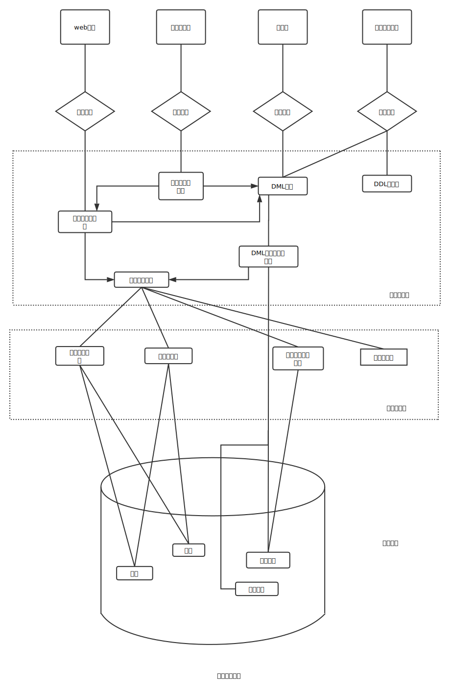

#### 验证码不失效
找回密码时获取的验证码缺少时间限制仅值判断了验证码是否正确未判断验证码是否过期

#### 验证码直接返回
验证码在客户端生成， 并直接返回在Respon以方便对接下来的验证码进行比对。

#### 验证码未绑定用户
输入手机号和验证码进行重置密码的时候，仅对验证码是否正确进行了判断，未对该验证码是否与手机号匹配做验证

#### 修改接收的手机或邮箱
用户名、手机号、验证码三者没有统一进行验证， 仅判断了三者中的手机号和验证码是否匹配和正确， 如果正确则判断成功并进入下一流程

#### 本地验证的绕过
客户端在本地进行验证码是否正确的判断，而该判断结果也可以在本地修改，最终导致欺骗客户端， 误以为我们已经输入了正确的验证码

#### 跳过验证步骤
对修改密码的步骤， 没有做校验， 导致可以直接输入最终密码修改密码的网址，直接跳转到该页面，然后输入新密码达到重置密码的目的。

#### 未校验用户字段的值
在整个重置密码的流程中， 只对验证码和手机号做了验证，未对后面设置新密码的用户身份做判断，导致在最后一步通过修改用户身份来重置他人的密码

#### 修改密码处id可替换
修改密码时，没有对原密码进行判断， 且根据id的值来修改用户的密码

#### cookie值替换
重置用户密码走到最后一步时仅判断唯一的用户标识cookie是否存在， 并没有判断该cookie有没有通过之前重置密码过程的验证，导致可替换cookie重置他人用户密码  

#### 修改信息时替换字段值
在执行修改信息的sql语句时，用户的密码也当作字段执行了，而且是根据隐藏参数loginid来执行的，这样就导致修改隐藏参数loginid的值，就可以修改他人的用户密码