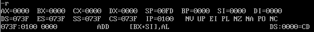
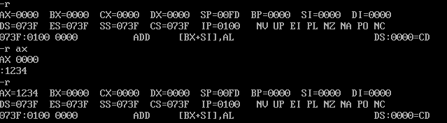
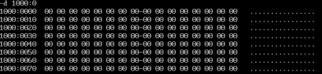
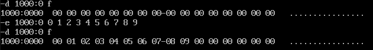
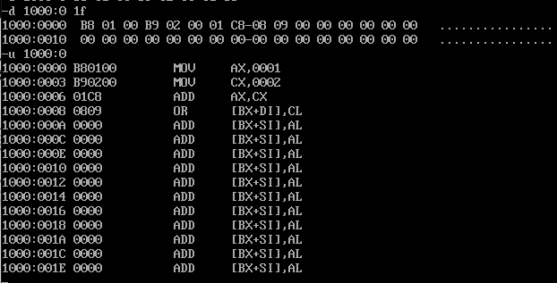
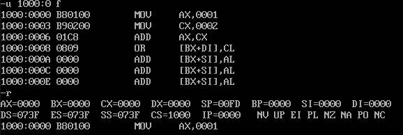
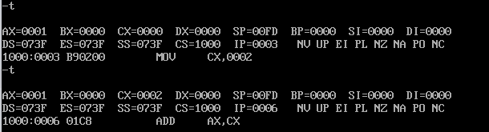
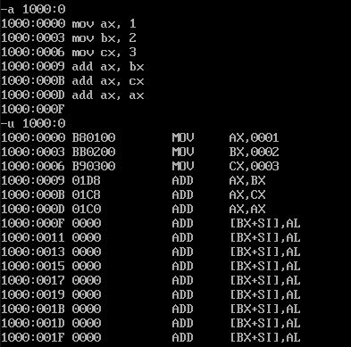

# Debug基本命令

## R: 查看、改变CPU寄存器的内容

### 查看寄存器内容

### 修改寄存器内容

## D: 查看内存中的内容
如果想知道内存10000H处的内容, 可以用"d段地址:偏移地址"的格式来查看

## E: 改写内存中的内容

## U: 查看写入的或内存中原有的机器码所对应的汇编指令

## T: 执行一条或多条指令
简单地使用T命令, 可以执行CS:IP指向的指令

## A: 以汇编指令的形式在内存中写入机器指令
