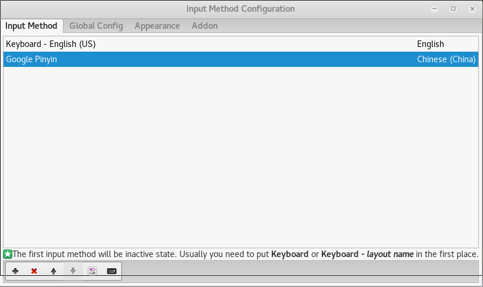
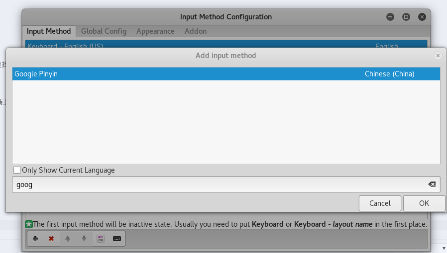

以下未特殊注明， 所有操作均在root账户下进行。
#### 安装中文输入法
1. 安装输入法框架fcitx
```
    apt install fcitx
```
2. 安装google拼音
```
    apt install fcitx-googlepinyin
```
3. 重启电脑
4. 在命令行输入fcitx-configtool， 添加输入法， 在查找内输入google就可以查找到之前安装的google拼音， 点击确定，关闭gui就可以通过ctrl+space切换输入法



如果希望折腾， 也可以尝试安装sougou拼音， 不过能不能装上， 那就需要看运气了

#### 截图工具
```
apt install scrot
```

1. 截取整个桌面
```
scrot
```
2. 使用鼠标选取指定位置
```
scrot -s
```

#### 安装雅黑和Consolas字体
1. 下载雅黑和Consolas[字体文件](./file/YaHeiConsolas.tar.gz)
2. 将文件放到系统字体文件夹内
```
    mkdir /usr/share/fonts/vista
    cp YaHeiConsolas.ttf /usr/share/fonts/vista
```
3. 赋予文件权限
```
    chmod 644 YaHeiConsolas.ttf
```
4. 安装字体文件并刷新缓存
```
    mkfontscale && mkfontdir && fc-cache -fv
```