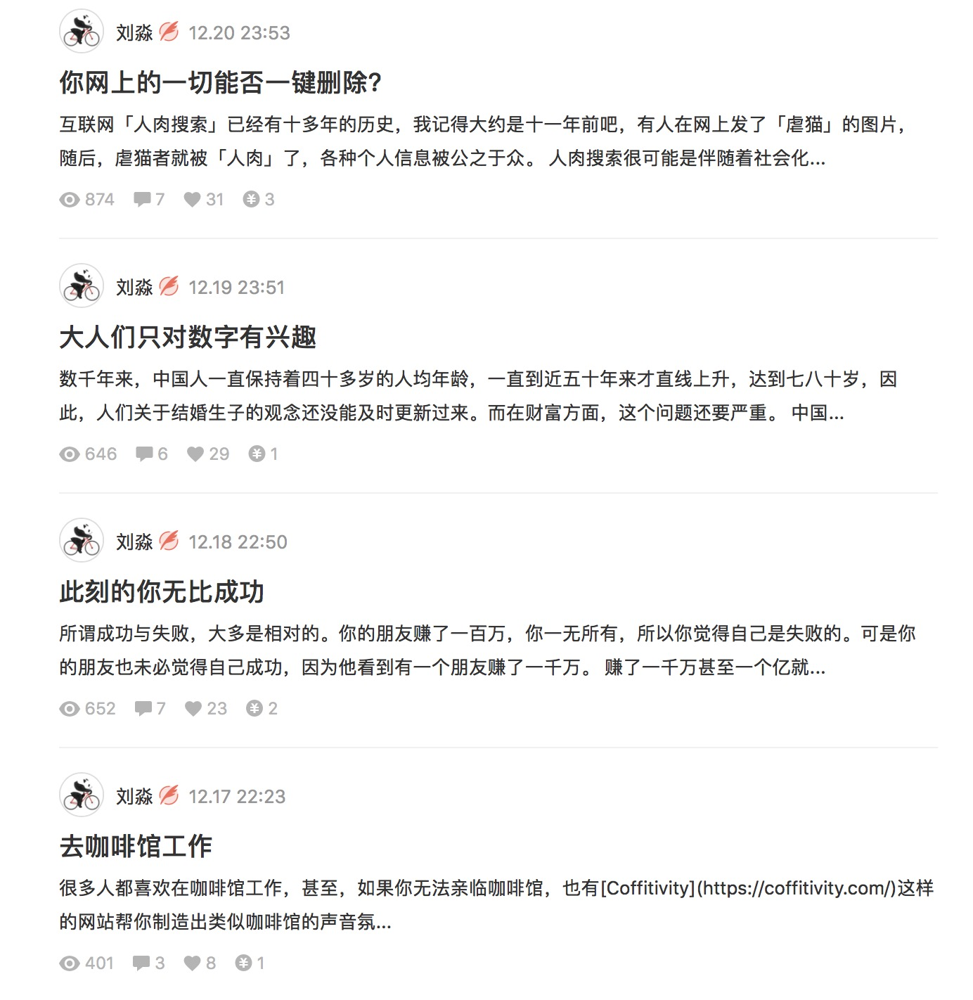

#### 2017-12-25 09:32:44
1. 最上边一个新增按钮 之后加上码表  根据通知状态不同,后半有个标签[红色的删除][绿色的正常][橙色的修改]之类的东西,最后加一列操作,删改差
2. 展示示例

#### 2017-12-27 10:57:04
后台提供核心数据 -->  
    可视化设计细节 -->  
        前端实现  
<del>交互: ux - ui - fe</del>  
展示: fe - web - end  
数据: end - web