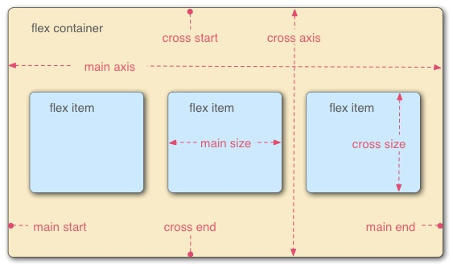

# Flex布局

## Flex基本概念
  
_flex_ 容器中默认存在两条轴, 水平主轴(_main axis_)和垂直的交叉轴(_cross axis_). 在容器中的每个单元块被称之为 _flex item_, 每个项目占据的主轴空间为(_main size_), 占据的交叉轴的空间为(_cross size_)

## Flex容器
首先, 实现flex布局需要先指定一个容器, 任何一个容器都可以被指定为 *flex* 布局.
```css
.container {
    display: flex | inline-flex;       //可以有两种取值
}
```
当设置flex布局之后, 子元素的*float*、*clear*、*vertical-align*属性将会失效.  
有以下6种属性可以设置在容器上, 分别是: 
1. *flex-direction*
2. *flex-wrap*
3. *flex-flow*
4. *justify-content*
5. *align-items*
6. *align-content*
   
### flex-direction: 决定主轴的方向(即项目的排列方向)
```css
.container {
    flex-direction: row | row-reverse | column | column-reverse;
}
```
row: 默认值, 主轴为水平方向, 起点在左端  
row-reverse: 主轴为水平方向, 起点在右端  
column: 主轴为垂直方向, 起点在容器上沿  
column-reverse: 主轴为垂直方向, 起点为容器下沿

### flex-wrap: 决定容器内子元素是否可换行
```css
.container {
    flex-wrap: nowrap | wrap | wrap-reverse;
}
```
nowrap: 默认值, 不换行, 当主轴尺寸固定, 空间不足时, 子元素尺寸会随之调整并不会被挤到下一行.  
wrap: 子容器主轴总尺寸超出容器时换行, 第一行在上方  
wrap-reverse: 子容器主轴总尺寸超出容器时换行, 第一行在下方  

### *flex-flow*: *flex-direction*和*flex-wrap*的简写
```css
.container {
    flex-flow: <flex-direction> || <flex-wrap>;
}
```
### *justify-content*: 定义了子容器在主轴的对齐方式
```css
.container {
    justify-content: flex-start | flex-end | center | space-between | space-around;
}
```
*flex-start*: 默认值, 左对齐  
*flex-end*: 右对齐  
*center*: 居中对齐  
*space-between*: 两端对齐, 项目之间的间隔相等, 即剩余空间等分成间隙  
*space-around*: 每个项目两侧的间隔相等, 所以项目之间的间隔比项目与边缘的间隔大一倍

### align-items: 定义了子容器在交叉轴上的对齐方式
```css
.container {
    align-items: flex-start | flex-end | center | baseline | stretch;
}
```
*stretch*: 默认值, 如果子容器未设置高度或者设置为auto, 将占满整个父容器的高度  
*flex-start*: 子容器在交叉轴的起点对齐, 即上图中的*cross start*处  
*flex-end*: 子容器在交叉轴的终点对齐, 即上图中的*cross end*处  
*center*: 子容器在交叉轴的中点对齐, 即上图中的*cross axis*的中点位置
*baseline*: 子容器在内部的第一行文字的基线处对齐

### align-content: 定义了多根轴线的对齐方式
如果主轴轴线只有一根, 那么该属性将不起作用.
```css
.container {
    align-content: flex-start | flex-end | center | space-between | space-around | stretch;
}
```

stretch: 默认值, 三条轴线平分容器的垂直方向上的空间.   
flex-start: 轴线全部在交叉轴的起点对齐  
flex-end: 轴线全部在交叉轴的终点对齐  
center: 轴线全部在交叉轴的中间对齐
space-between: 轴线两端对齐, 之间的间隔相等, 即剩余空间等分成间隙  
space-around: 轴线两端对齐, 轴线与父容器边框的距离为轴线之间距离的一半

### *Flex*子容器属性
有6种属性可运用在*flex*子容器上:  
1. *order*
2. *flex-basis*
3. *flex-grow*
4. *flex-shrink*
5. *flex*
6. *align-self*

### *order*: 定义子容器在父容器种的排列顺序, 数值越小, 排列越靠前, 默认值为0
```css
.item {
    order: <integer>;
}
```

### *flex-basis*: 定义了在分配多余空间之前, 项目占据的主轴空间
浏览器根据这个属性, 计算主轴是否有多余空间
```css
.item {
    flex-basis: <length> | auto;
}
```
*auto*: 默认值, 即子容器本来的大小, 这时候子容器的宽高取决于*width*或*height*的值
主轴为水平方向的时候, 当设置了*flex-basis*, 子容器的宽度设置值会失效. *flex-basis* 需要跟 *flex-grow*和*flex-shrink*配合使用才能发挥效果. 
> 当flex-basis值为0%时, 是把该子容器视为零尺寸的, 故即使声明尺寸为140px, 也不会生效

### *flex-grow*: 定义项目的放大比例
```css
.item {
    flex-grow: <number>;
}
```
默认值为0, 即如果存在剩余空间, 也不放大. 子容器占据剩余空间的比例根据*flex-grow*的值占所有设置*flex-grow*值之和的比例决定

### *flex-shrink*: 定义了项目的缩小比例
```
.item {
    flex-shrink: <number>;
}
```
默认值: 1, 如果空间不足, 该项目将缩小, 负值无效.如果所有项目的 flex-shrink 属性都为 1, 当空间不足时, 都将等比例缩小.  如果一个项目的 flex-shrink 属性为 0, 其他项目都为 1, 则空间不足时, 前者不缩小. 

### *flex*: *flex-grow*, *flex-shrink*和*flex-basis*的简写
```css
.item{
    flex: none | [ <'flex-grow'> <'flex-shrink'>? || <'flex-basis'> ]
} 
```
flex的默认值是以上三个属性值的组合. flex的默认值是0 1 auto.  
flex取值的特殊情况:  
* flex取值为一个非负数字, 则该数字为flex-grow值, flex-shrink取1, flex-basis取0%, 如下是等同的.
```css
.item {flex: 1;}
.item {
    flex-grow: 1;
    flex-shrink: 1;
    flex-basis: 0%;
}
```
* 当flex取值为0时, 对应的三个值分别为0 1 0%
```css
.item {flex: 0;}
.item {
    flex-grow: 0;
    flex-shrink: 1;
    flex-basis: 0%;
}
```
* flex 取值为一个长度或百分比，则视为*flex-basis*值, *flex-grow*取 1, *flex-shrink*取 1, 有如下等同情况(注意 0% 是一个百分比而不是一个非负数字)
```css
.item-1 {flex: 0%;}
.item-1 {
    flex-grow: 1;
    flex-shrink: 1;
    flex-basis: 0%;
}

.item-2 {flex: 24px;}
.item-2 {
    flex-grow: 1;
    flex-shrink: 1;
    flex-basis: 24px;
}
```
* *flex*取值为两个非负数字, 则分别为*flex-grow*和*flex-shrink*的值, *flex-basis*取0%, 如下是等同的.
```css
.item {flex: 2 3;}
.item {
    flex-grow: 2;
    flex-shrink: 3;
    flex-basis: 0%;
}
```
* *flex*取值为一个非负数字和一个长度或百分比, 则分别视为*flex-grow*和*flex-basis*的,*flex-shrink*取1, 如下是等同的.
```css
.item {flex: 11 32px;}
.item {
    flex-grow: 11;
    flex-shrink: 1;
    flex-basis: 32px;
}
```

### *align-self*: 允许单个项目有与其他项目不一样的对齐方式
在子容器中覆盖*align-items*定义的属性.  
默认值为*auto*, 表示继承父容器的*align-items*属性.
```css
.item {
     align-self: auto | flex-start | flex-end | center | baseline | stretch;
}
```
这个跟*align-items*属性是一样的, 只不过*align-self*是针对单个子容器生效的, 而*align-items*则是对所有子容器生效的.