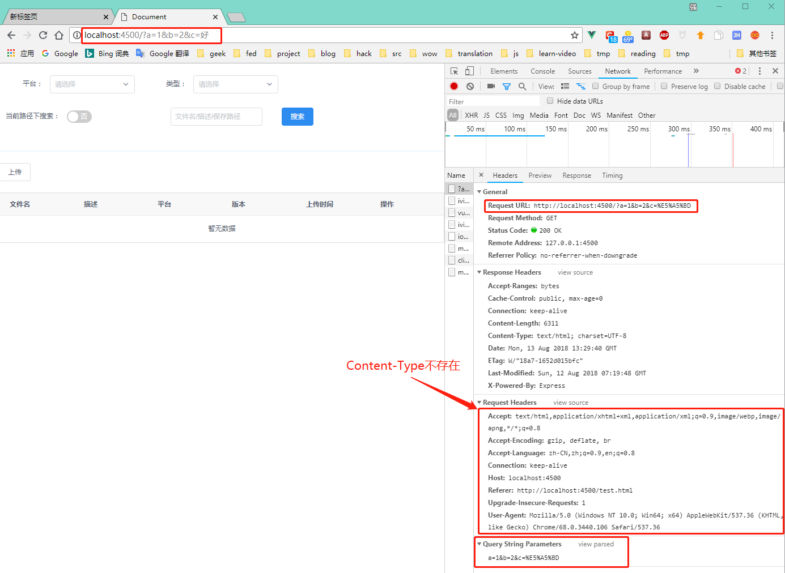
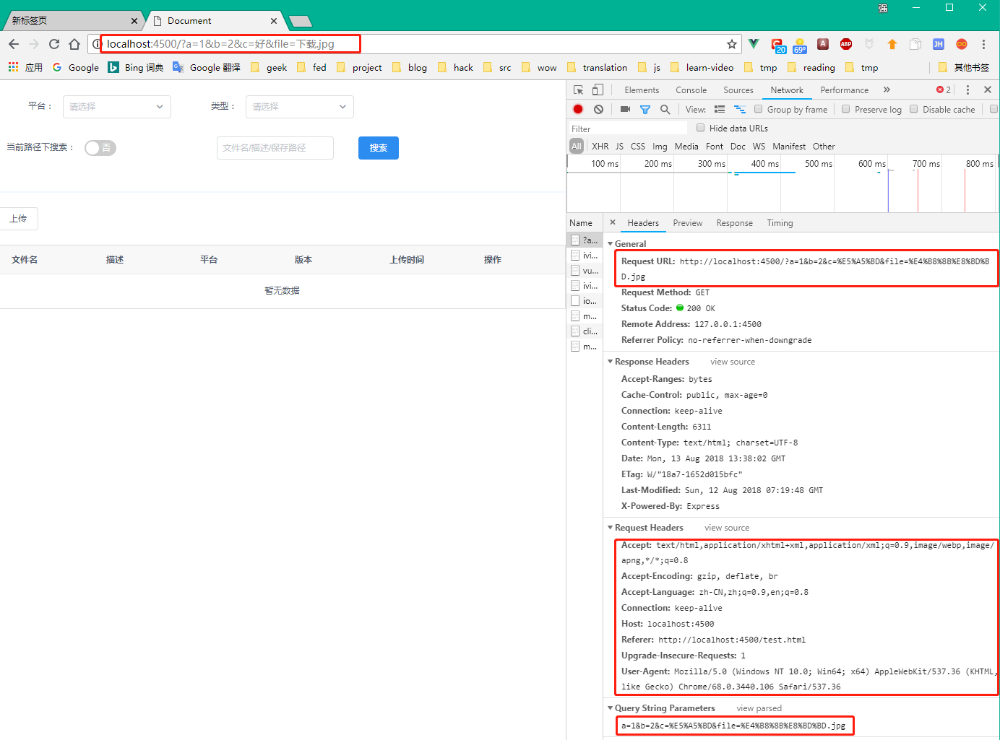
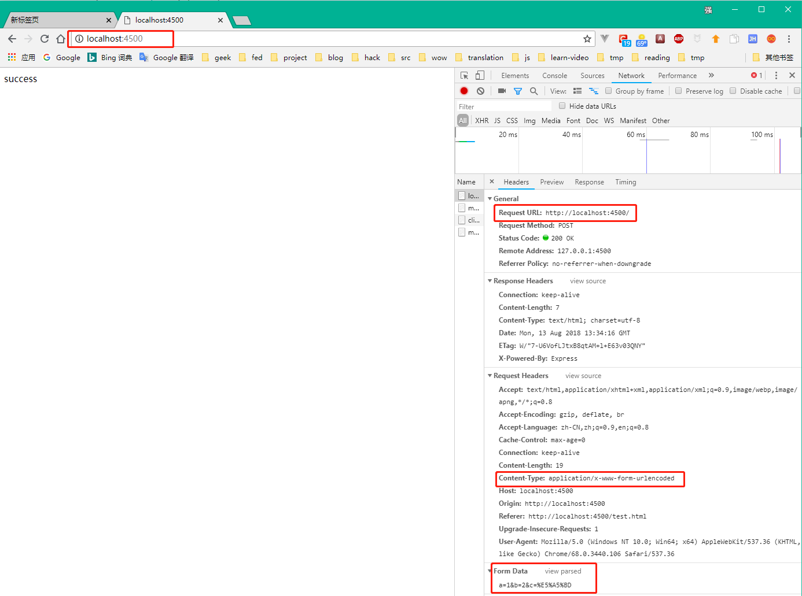
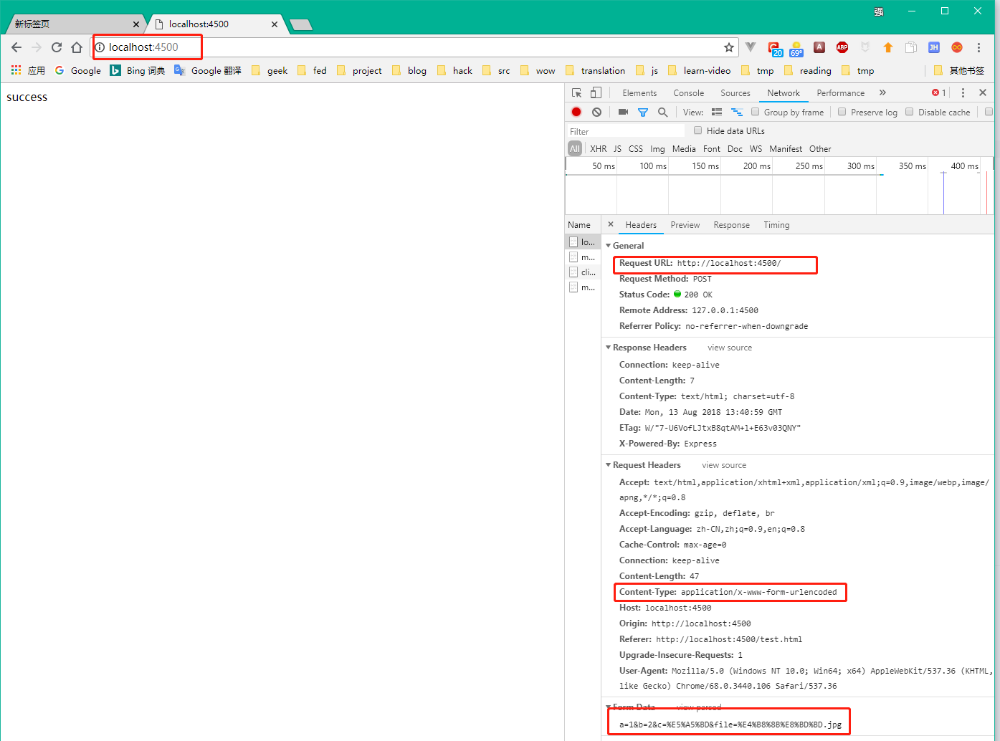
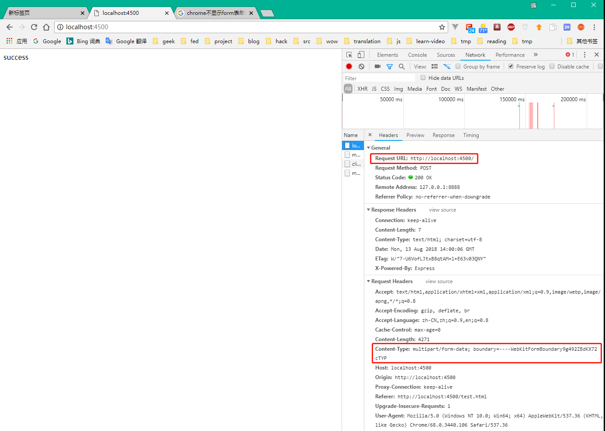
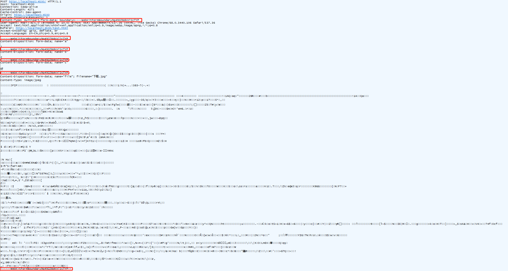

# 浅谈Form表单与Ajax(1)--- form提交

在前端开发过程中, 对form表单的使用是很常见的. 但是, 我们却经常会遇到这样的问题: 诶, 我传的参数为什么后台收不到; 传了好几个文件, 为啥后台就收到了一个;我传的参数没问题啊, 为啥后台报了400? 这些问题的解决很简单, 可能只是改一下参数, 但是解决的过程可能很心酸. 毕竟问题出在哪里很难去定位. 今天, 我就带着大家一起, 来绕过那些年踩过的坑.

## form的enctype
在[html5](https://www.w3.org/TR/2014/REC-html5-20141028/forms.html#attr-fs-enctype)规范中, 定义了三种类型的enctype.
- application/x-www-form-urlencoded
- multipart/form-data
- text/plain  
但是, 在日常的使用过程中, 我们很少会去设置enctype,. 因为, 浏览器会根据我们提交的数据类型自动帮我们设置, 这些值最终会体现在请求的Content-Type头部字段中.  
以下列举了常见的表单提交中, 浏览器的默认Content-Type值.
1. method属性未设置

2. method属性未设置且表单中包含有文件

3. method属性设置为post

4. method属性设置为post且表单中包含有文件

1. 将method属性设置为post, enctype设置为 _multipart/form-data_ 时, 会出现下面的结果:

由于chrome隐藏了form表单提交的数据信息, 我们使用fiddler抓包软件来获取传输的数据信息.

从图中可以看到, Content-Type中不仅包含multipart/form-data这个设置form中的enctype属性的值之外, 还包含了另一个值: boundary=----WebKitFormBoundary9g492ZBdKX72cTYP. 这个值的作用是什么呢? 先留个悬念, 容后再说.  
如果将表单提交时, 所有可能的情况都列举出来, 这可以得到下面这个表格中的结果.

|编号|enctype值|请求方式|包含文件|提交结果|
|:---|:---|:---|:---|:---|
|1|-|-|无|提交数据拼接在url的query参数上, 无Content-Type头部信息|
|2|application/x-www-form-urlencoded|-|无|提交数据拼接在url的query参数上, 无Content-Type头部信息|
|3|multipart/form-data|-|无|提交数据拼接在url的query参数上, 无Content-Type头部信息|
|4|text/plain|-|无|提交数据拼接在url的query参数上, 无Content-Type头部信息|
|5|-|get|无|提交数据拼接在url的query参数上, 无Content-Type头部信息|
|6|application/x-www-form-urlencoded|get|无|提交数据拼接在url的query参数上, 无Content-Type头部信息|
|7|multipart/form-data|get|无|提交数据拼接在url的query参数上, 无Content-Type头部信息|
|8|text/plain|get|无|提交数据拼接在url的query参数上, 无Content-Type头部信息|
|9|-|-|有|提交数据拼接在url的query参数上, ,且包含文件的名称, 无Content-Type头部信息|
|10|application/x-www-form-urlencoded|-|有|提交数据拼接在url的query参数上, ,且包含文件的名称, 无Content-Type头部信息|
|11|multipart/form-data|-|有|提交数据拼接在url的query参数上,且包含文件的名称, 无Content-Type头部信息|
|12|text/plain|-|有|提交数据拼接在url的query参数上, ,且包含文件的名称, 无Content-Type头部信息|
|13|-|get|有|提交数据拼接在url的query参数上, ,且包含文件的名称, 无Content-Type头部信息|
|14|application/x-www-form-urlencoded|get|有|提交数据拼接在url的query参数上, ,且包含文件的名称, 无Content-Type头部信息|
|15|multipart/form-data|get|有|提交数据拼接在url的query参数上, ,且包含文件的名称, 无Content-Type头部信息|
|16|text/plain|get|有|提交数据拼接在url的query参数上, ,且包含文件的名称, 无Content-Type头部信息|
|17|-|post|无|数据以key=value形式的字符串传递, 中间以&符号进行拼接, 并且header中Content-Type值为application/x-www-form-urlencoded|
|18|application/x-www-form-urlencoded|post|无|数据以key=value形式的字符串传递, 中间以&符号进行拼接, 并且header中Content-Type值为application/x-www-form-urlencoded|
|19|multipart/form-data|post|无|数据以form-data形式传递, 每条数据中间使用特殊的字符串进行分隔, 并且header中Content-Type值为multipart/form-data|
|20|text/plain|post|无|数据以key=value形式的字符串传递, 每条数据中间使用换行符进行分隔|
|21|-|post|有|数据以key=value形式的字符串传递, 中间以&符号进行拼接, 包含文件名信息, 但不包含文件数据, 并且header中Content-Type值为application/x-www-form-urlencoded|
|22|application/x-www-form-urlencoded|post|有|数据以key=value形式的字符串传递, 中间以&符号进行拼接, 包含文件名信息, 但不包含文件数据, 并且header中Content-Type值为application/x-www-form-urlencoded|
|23|multipart/form-data|post|有|数据以form-data形式传递, 每条数据中间使用特殊的字符串进行分隔, 包含文件数据, 并且header中Content-Type值为multipart/form-data|
|24|text/plain|post|有|数据以key=value形式的字符串传递, 包含文件名称, 但不包含文件数据, 每条数据中间使用换行符进行分隔|

## 小结
根据上面的请求截图和表格, 可以总结出以下几条结论:
1. form表单默认以get方式提交, 且以get方式进行提交时, enctype设置不生效, 所有提交的数据都会拼接在当前url的查询参数上
2. 当表单中有文件数据时, 无论何种方式, 提交数据中都会包含文件名数据, 但只有在post请求时设置enctype为multipart/form-data才会提交文件数据.
3. post请求下form的enctype默认为application/x-www-form-urlencoded, multipart/form-data只有显式设置时, 才会生效.

在日常的开发过程中, 现在已经很少使用get方式进行表单数据的提交了, 所以, 在通常情况下, 我们使用post方式进行数据提交就可以满足要求, 如果包含文件, 把enctype设置为multipart/form-data. 但是, 由于SPA的盛行, form提交会导致页面跳转的问题就无法满足需求了. 那么, 就需要接下来的ajax来完成这个工作了.